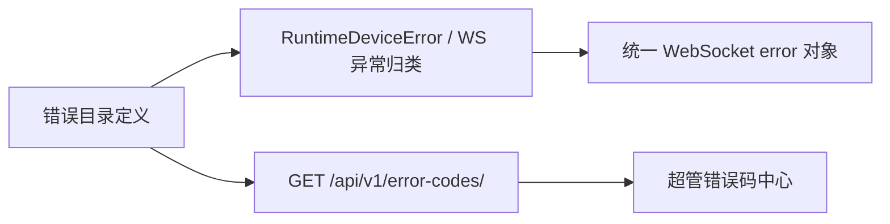

# 统一实时错误码与超管目录：技术设计

## Boundary

新增无状态的全局错误码目录模块 `apps.error_codes`。该模块不含模型或迁移，拥有错误定义、只读 REST API 与序列化；它是 WebSocket 发送器和超管 UI 的唯一错误语义来源。设备服务、ASR、TTS、LLM 与实时协议不得再各自声明同义 code/message。

错误目录定义冻结的 `RealtimeErrorDefinition`：

- `code`：稳定大写蛇形字符串，客户端唯一判断依据。
- `default_message`：面向操作端的默认中文提示。
- `category`：`device_runtime`、`realtime_protocol`、`asr`、`tts`、`llm`、`agent` 等。
- `description`：超管解释“为何发生、影响是什么”。
- `recommended_action`：明确后台处置步骤。
- `transports`：首期为 `websocket`，为后续 HTTP 复用预留。
- `legacy_status_code`：仅展示现有设备运行时 `440xx` 业务状态码；不再进入 WebSocket payload。

错误码是编译期契约，不可由数据库或 UI 编辑。错误目录 API 只读、无需迁移，也避免协议文案与运营编辑内容分叉。

## WebSocket contract

保留既有错误事件类型以避免业务事件路由变化：`error`、`agent.error`、`llm.error`、`asr.error`、`tts.error`。所有这些事件使用同一 payload：

```json
{
  "type": "agent.error",
  "id": "command-id",
  "requestId": "request-id",
  "traceId": "trace-id",
  "error": {
    "code": "DEVICE_EXPIRED",
    "message": "设备授权已过期"
  }
}
```

- `id`、`requestId`、`traceId` 原样保留；没有请求关联值时保留现有空值语义。
- `code`、`message` 只能位于 `error` 对象内。
- 移除运行时错误旧的顶层 `code`、`statusCode`、`message`；这是用户确认的直接切换，不维护双写兼容层。
- 每个裸 `RuntimeError`、上游异常和会话状态错误都在发送边界归类为目录中的明确 code；未知异常使用安全的 `INTERNAL_ERROR`，不向设备泄露底层异常文本。

`RuntimeDeviceError` 保留 HTTP 使用的业务状态码，但改为引用目录定义，避免 `runtime.py` 的 `DEVICE_*` 元组与全局目录重复维护。`DEVICE_AGENT_UNBOUND` 与 `DEVICE_TENANT_UNBOUND` 必须在受影响 WS 路径按其真实原因返回，不能继续被折叠为裸文本或 `device_not_found`。

## Data flow



错误目录 API：

- `GET /api/v1/error-codes/?keyword=&category=`：按 code、默认提示、说明检索；返回标准分页列表。
- `GET /api/v1/error-codes/{code}/`：按稳定 code 获取详情。
- 两端点均使用 `IsSuperUser`；没有 tenant 参数，不能通过平台公司作用域访问。
- 资源输出使用 camelCase：`legacyStatusCode`、`defaultMessage`、`recommendedAction`、`transports`。

## Superadmin UI

新增 `ErrorCodeCenterPage` 和 `api/modules/error-codes.ts`。页面使用既有 `.page-hero`、`container`、`text-fluid-*` 和 antd Table，支持关键字和分类筛选；移动端表格设置 `scroll.x`。列表展示错误码、业务状态码、分类、默认提示、说明、推荐处理方式、适用通道；详情使用抽屉或展开行，不提供编辑控件。

`DashboardLayout` 的超管专属菜单树中加入一级“错误码中心”。现有超管菜单树由 `tenant.management.view` 触发，故该条目必须按 `isSuperuser` 单独条件渲染；路由使用既有 `SuperuserGuard`，防止拥有其他平台权限的非超管看到或直达。

## Tests and migration

- 为目录 API 覆盖：超管可列出/检索、非超管 403、返回字段和固定错误码集合。
- 为 WebSocket 覆盖：协议错误、设备运行时错误、agent/LLM/ASR/TTS 错误均断言 `error.code`、`error.message` 及关联字段；断言旧顶层错误字段不存在。
- 更新所有现有 WebSocket 断言和任何 Web 前端消费者，避免读取旧平铺字段。
- 前端仅通过错误目录 API 展示说明，不复制错误码映射。

## Risks and rollback

直接切换会使未同步客户端无法读取旧顶层字段；这是用户明确接受的发布约束。出现问题时可回退本变更的服务端与前端版本；不引入数据库迁移，因此没有数据回滚步骤。
