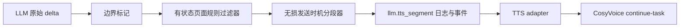

# Design: 智能体 TTS 严格过滤与无损分段

## Decision Summary

最终 TTS 文本只由智能体页面三项规则决定：

1. `ttsFilterExcludePatterns`：按页面顺序删除完整文本片段；
2. `ttsFilterEmoji`：开启时删除项目既有 emoji 字符集合；
3. `ttsFilterPunctuation`：删除字段中逐个明确保存的字符。

Markdown、列表符号、编号、空格、换行和句读均不再由代码隐式处理。分段只决定何时发送，不能改变字符。

## Root Cause

当前有三层与页面配置无关的文本变换：

- Python `sanitize_tts_text()` 调用 `strip_markdown_for_tts()`，替换 Markdown 字符、折叠空格/换行并 `strip()`；
- Python `split_tts_text()` / `pop_tts_text_segments()` / `_remove_tts_exclude_patterns()` 再次 `strip()`；
- TypeScript `sanitizeTtsText()`、`extractReadyTtsSegments()` 和 `removeTtsExcludePatterns()` 同样清理 Markdown并 `trim()`。

此外，`AgentApplicationSerializer` 默认裁剪空白，`validate_ttsFilterPunctuation()` 再次 `.strip()`，导致页面输入的空格不能保存；单行输入框中的字面 `\\n` 没有被解释成换行。

## Contract and Invariant

定义完整文本规则函数：

```text
F(text, rules)
  = delete_configured_characters(
      delete_emoji_if_enabled(
        remove_excluded_patterns_in_page_order(text)
      )
    )
```

静态和流式路径必须满足：

```text
''.join(emitted_segments) == F(''.join(raw_llm_deltas), rules)
```

该等式按 Unicode 字符逐个比较。片段边界不参与比较；片段内部及片段之间不得丢失、增加、折叠或替换字符。

## Backend Architecture



边界标记是内部元数据，不是插入文本。原始句读/CR/LF 即使随后被页面字符规则删除，其停顿位置仍可触发 segment；最终拼接值只包含过滤后的真实字符。

### 1. 单一规则实现

在 `backend/apps/ai_models/services/tts.py` 收敛两个职责：

- `apply_agent_tts_rules(text, ...)`：按“不播报文本 → emoji → 配置字符”的唯一顺序计算完整文本；先匹配原始短语，避免短语内的 emoji/标点先删后导致配置规则失配；
- 流式规则状态：接受带原始边界元数据的 delta，输出已经确定不会被后续 delta 改变的过滤后字符和零宽边界信号，`flush()` 处理尾部。

`sanitize_tts_text()` 不再承担 Markdown 或空白清理。旧名字若不再表达职责则删除并迁移所有调用方，不保留兼容别名。

### 2. 跨 delta 的“不播报文本”

排除文本可能跨越任意 delta，例如规则 `内心独白` 可能按 `内心` + `独白` 到达。不能先播报前缀再在下一块发现完整匹配。

实现为按页面顺序串联的流式字面量删除器：

- 每一级对应一个排除文本，语义与当前依次执行 `result.replace(pattern, '')` 一致；
- 每一级只暂存可能成为该 pattern 前缀的最短必要后缀；
- 完整匹配立即丢弃；确定不可能匹配的字符传给下一级；
- `flush()` 时释放所有未完成的普通文本；
- 重叠、重复和跨 delta 情况用所有切点的等价性测试固定。

之后再执行 emoji 和配置字符删除；这两项是逐字符规则，不需要回看已发文本。

### 3. 无损分段

`split_tts_text()` 与 `pop_tts_text_segments()` 改为只选择切点：

- 只把原文句读（沿用并明确现有中英文句号、问号、叹号、分号、冒号、逗号、顿号集合）、CR/LF 和最终 flush 视为边界；空格、闭合括号和引号本身不创建边界；
- 相邻在边界后的闭合引号/括号可随前段保留，但不能在没有句读时自行触发切分；
- 删除 12/30/80 与其他字符长度阈值；长度绝不单独触发切分；
- 先在原始字符流记录边界，再执行页面规则。若边界字符被配置删除，只删除字符值而保留零宽切点；不得向文本补回标点；
- 不调用 `strip()`、`trim()`、空白正则、Markdown 清理或标点恢复；空白-only delta 也是有效输入，只有真正的空字符串可跳过；
- `remainder + emitted segments` 始终能还原当前过滤后输入；flush 后 remainder 必须为空。

`_send_llm_tts_segment()`、`_agent_tts_segments()`、`stream_cosyvoice_realtime_segments()` 及其他 adapter 边界不得再 `.strip()`。日志、WebSocket `llm.tts_segment` 与真正传给 adapter 的 segment 使用同一字符串值；只有由页面规则删除成真正空值的 segment 才不发送。

### 4. Aliyun Protocol

不改协议与连接复用：一个任务内继续按顺序发送多个 `continue-task`，最后 `finish-task`。阿里文档明确说明完整句会立即合成，不完整句会暂存；因此本地只需保留句读并选择低延迟切点，无需清洗回答内容。

## API and Data

### Existing field remains authoritative

继续使用：

- API：`ttsFilterPunctuation: string`
- Django：`tts_filter_punctuation: CharField(max_length=64)`
- 发布快照：`published_config['tts_filter_punctuation']`

不新增 `filterSpace` / `filterNewline` 数据库字段，避免同一规则出现两个真相来源。

### Serializer

- `CharField(..., trim_whitespace=False)`；
- validator 去重但不 `.strip()`；
- U+0020、`\r`、`\n` 都计入 64 字符上限并原样发布；
- 排除文本仍禁止空白项，其现有 trim 语义不变。

### Data migration

新增数据迁移，处理本次确认的唯一历史误配置：

- 草稿值精确等于字面 `\\n` 时，改为真实 `" \r\n"`；
- 已发布快照值精确等于字面 `\\n` 时，同步改为真实 `" \r\n"`；
- 不改普通标点规则，不解析混合字符串里的反斜杠转义；
- 草稿与发布态同步迁移，智能体 48 保持 `is_published_current=True`。

选择 `" \r\n"` 是因为用户确认原页面意图是“一个空格和 `\\n`”；当前数据库盘点只有这一条字面 `\\n`。

## Frontend Design

### Canonical state

`ttsFilterPunctuation` 仍是唯一 canonical state：

- 可见字符输入框展示并编辑除 U+0020、CR、LF 外的字符；
- “过滤半角空格”由字符串是否包含 U+0020 派生；
- “过滤换行（CR/LF）”由字符串是否包含 CR/LF 派生；
- 开关操作在同一字符串中添加/删除真实字符；
- 保存、dirty 检测、发布 mismatch、调试播报全部读取同一个字符串。

这样页面有可见控制，API 又没有平行布尔字段。

### UI

在现有“过滤规则”区域增加两个响应式选项：

- `过滤半角空格`；
- `过滤换行（CR/LF）`。

帮助文案明确：列表横线、Markdown 符号和句读不会自动删除；需要删除 `-`、`*` 等字符时必须填入可见字符输入框。新增文案使用项目 `text-fluid-*` 字体类，不增加硬编码字号、`teal-*` 或 Tailwind `!` 覆盖。

### Browser playback parity

`tts-realtime-playback.ts` 与 `use-agent-audio.ts` 执行同一契约：

- 删除 `stripMarkdownForTts()`、`trim()` 和空白-only delta 跳过逻辑的隐式参与；
- `extractReadyTtsSegments()` 返回无损切片，只在原文句读/CR/LF 或最终 flush 处分段；
- 单次播放先对完整原文执行一次“不播报文本 → emoji → 配置字符”，随后以无规则的 identity 路径发给 TTS；
- 流式播放使用同一个有状态规则器跨 delta 过滤，入队后不得在 `playQueuedStreamSegments()` 再次删除排除文本或应用字符规则；
- `playRealtimeTts()` 对已过滤文本的无规则调用必须逐字符 identity，避免第二轮规则删除新形成的匹配；
- 单次“播放整段文本”和流式自动播报得到相同过滤结果。

## Exact Experiment Consequence

对 conversation 2353 的回答：

- 当前原文包含 52 个空格、24 个换行；
- 迁移后智能体 48 明确配置空格与 CR/LF，所以这些字符会按页面规则删除；
- 页面没有配置 `-`，因此 Markdown 列表横线必须保留；代码不得替用户猜测并删除；
- 若用户不希望横线进入 TTS，应在页面可见字符框明确加入 `-`。

这会暴露 LLM 未遵守“不要 Markdown”提示词的问题，但不会再由 TTS 层静默篡改回答。

### Browser experiment: conversation 2354

通过 `device-chat/runtime-api-console.html` 的真实“智能体回答”入口再次只问“你们公司有哪些产品”：

- `requestId=req-msh21kxd-1680d3`、`traceId=trace-msh21kxd-1680d3`、`conversationId=2354`；
- 浏览器抓帧证明所有 `llm.delta` 与 `llm.done.answerText` 完全一致，并完整收到 31 个 TTS 片段、458 个 PCM 帧、3,413,520 bytes，最终到达 `tts.done`；
- 原文 358 字符中有 16 个空格、7 个换行、4 个列表横线；TTS 片段拼接后恰好少掉这 27 个字符，页面字面规则 `\\n` 对本回答匹配 0 次；
- 本次 LLM 在 `球形LED显示屏、内球幕LED显示屏、` 之间主动生成了顿号，因此该处不复现“无标点黏连”；但另外三个 Markdown 列表边界仍被压成 `LED室内显示屏LED显示屏租赁、`、`LED门楣屏室内LED照明、`、`景观照明COB小间距显示屏、`，复现了同一根因。

结论：具体哪两个产品黏连会随 LLM 当次是否生成句读而变化；稳定缺陷是本地 sanitizer 把未配置删除的 Markdown 空白边界改成零字符，而 CosyVoice 在同一 task 中按连续文本继续合成。修复必须依赖逐字符守恒契约，不能只针对“球形/内球幕”样本文案补标点。

## Performance and Regression Boundary

自然度修复不能改变三合一首音架构：

- 删除 `PROGRESSIVE_TTS_CHUNK_SIZES = (12, 30)`、80 字硬上限和空格/闭合括号/引号切点；后端 `split_tts_text()`、`pop_tts_text_segments()` 与前端 `extractReadyTtsSegments()` 只在原文句读、换行或最终 flush 处分段，不用另一个长度阈值替代；
- 分段先识别原文边界，再应用页面明确配置的字符删除。即使用户选择过滤句号，句号所在位置仍是边界，但发送文本中不再包含该字符；未配置过滤时边界字符必须留在前段；
- `_prepare_agent_tts()` 仍先于 `queue.get()`，授权解析、适配器配置与 CosyVoice `run-task/task-started` 继续与 LLM TTFT 并行；上游 task 仍有效的正常路径中，首个安全边界到达后同步入队，首段前不得新增 ORM、HTTP/WebSocket、sleep、锁等待或其他 awaited 操作；
- 整条正常回答仍只使用一个实际合成的 CosyVoice task；每个 `continue-task` 承载一个安全切片，但消息边界本身不被代码当作新增标点。阿里可继续缓存最终未完成语句，PCM 到达即转发，不聚合完整音频；其他 adapter 只能在安全边界或最终 flush 时 commit；
- 新规则状态只消费新增 delta，禁止每次对累计回答重新执行完整 sanitizer。无排除文本时过滤器逐字符直通；配置排除文本时只保留判定跨 delta 匹配所必需的最长候选后缀。
- 预热句柄记录创建时间。首个安全切片出现前若接近阿里 23 秒发送间隔上限，关闭这个尚未承载文本的陈旧 task，等切片到达后重新建 task；不得发送空字符串、伪标点或半句保活。流中若真实边界间隔超过协议能力，则沿用隔离的 `tts.error`，LLM 仍到达 `agent.done`。

浏览器修改前基线共三次：

| 区间 | 三次结果 | 中位数 |
|---|---:|---:|
| LLM 开始 → 首字 | 1.72s / 1.42s / 1.26s | 1.42s |
| LLM 开始 → 首播报片段 | 1.88s / 1.61s / 1.46s | 1.61s |
| 首播报片段 → TTS ready | 34ms / 2ms / 1ms | 2ms |
| TTS ready → 首个 PCM | 884ms / 880ms / 754ms | 880ms |

LLM 内容和阿里公网时延有外部波动，因此速度保证分两层：确定性测试保证首个真实停顿边界在到达它的同一次同步处理内 emit，且不增加关键路径 I/O；真实回归要求三次中位数 `segment → ready <= 102ms`、`ready → PCM <= 1.15s`。删除 80 字硬切后，刻意不带任何句读的长句会等到真实边界或回答结束，这是自然度约束而非性能回归；整轮完成时间仍不作为代码门槛。

非目标逻辑边界：不修改 ASR 状态机、LLM 请求/会话 ID、知识库、设备鉴权、控制命令判定与执行、打断/取消、错误码与错误隔离、音频编码、WebSocket URL/type 或 `agent.done` 顺序。

## Compatibility and Cutover

- API 字段名和类型不变，旧前端仍可读取字符串；
- 数据迁移后字面 `\\n` 不再误删英文小写 `n`；
- 所有调用点一次性迁移，不保留旧 Markdown sanitizer、默认标点常量或兼容分支；
- TTS 模型、音色、WebSocket URL、消息 type、二进制音频协议均不变。

## Verification Design

### Deterministic tests

- 字符规则：未配置时逐字符保留 Markdown、空格、换行、句读；配置后只删指定字符；
- 特殊字符 API：`" \r\n"` create/update/read/publish/runtime 原样 round-trip；
- 历史迁移：字面 `\\n` 的 draft/published 转换，普通标点不变；
- 分段守恒：静态与流式所有 delta 切点均满足拼接等式；边界字符保留在前段；
- 无硬切：80、81、200 及 19,999 字无句读文本在非 flush 状态均不 emit；追加真实边界后立即 emit；flush 原样输出 remainder；
- 边界优先于字符删除：配置删除句号/换行时仍在其原位置切分，但输出只缺少用户明确配置删除的字符；
- 排除文本：跨 delta、重叠、完全删除、flush 未完成前缀；
- WebSocket：捕获 adapter 输入与 `llm.tts_segment`，按顺序拼接后逐字符一致；
- adapter：CosyVoice 的每个 `continue-task.input.text` 保留前导/尾随空白和边界字符，未完成语句不被本地强制 commit；
- 性能拓扑：预热必须先于首段等待，单 task/双工发送必须保持，PCM 不得整段缓存；
- 首段时机：记录同一组 delta，首个真实停顿边界到达时必须在该次处理内 emit；空排除规则不得产生过滤前缀缓冲；
- 协议极限：CosyVoice 单消息 20,000、累计 200,000 字符；首段前陈旧预热句柄安全重建；不可分超长句或流中超过 23 秒无安全边界时显式 TTS 失败，不影响 `agent.done`；
- 非回归：保留 TTS 失败仍到达 `agent.done`、取消/空回答关闭预热句柄、事件顺序与错误码测试。

### Runtime smoke test

1. 在智能体页面确认特殊字符选项可见并保存发布；
2. 仅通过 `apifox` 三合一接口提问“你们公司有哪些产品”；
3. 对账 `llm.response.answerText`、规则函数预期值、全部 `llm.tts_segment` 拼接值、CosyVoice `continue-task` 文本；
4. 实际播放音频，确认顺序完整、没有“球形…内球幕…”因隐式删标点造成的异常黏连；
5. 使用一条超过 80 字但中间没有句读的固定文本，确认不会在任意字符处断句；最终 flush 后完整播报；
6. 不发送其他业务问题；
7. 连续执行三次指定产品问题，记录 `LLM开始 → 首个真实边界`、`首边界 → TTS ready`、`TTS ready → 首个 PCM`；
8. 以三次中位数检查 `segment → ready <= 102ms`、`ready → PCM <= 1.15s`；超限时先重跑并检查是否出现新增首段 await/I/O；
9. 验证 ASR、LLM、控制命令、中断、TTS 失败与 `agent.done` 既有回归测试全部通过。

## Risks

- **流式排除规则**：若前缀保护不完整，已播文本无法撤回；用所有 delta 切点和重叠模式测试约束。
- **延迟**：删除任意长度硬切后，无句读长句只能等到真实边界或回答结束；这是避免半句播报的必要取舍。常规回答在首个冒号、逗号、顿号、句末标点或换行处立即放行，并继续使用预热、单 task、双工发送控制首音延迟。禁止以恢复 80 字硬切、换成更大阈值或插入伪标点解决延迟。
- **严格语义变化**：未配置的 Markdown 符号会进入 TTS。这是本次核心契约，不作为回归恢复隐式清理。
- **跨端漂移**：Python 与 TypeScript 必须共享同一输入/期望 fixture 或逐项镜像测试，不能只凭相似实现。
- **供应商极限**：CosyVoice 单消息上限 20,000 字符、累计 200,000 字符且发送间隔不得超过 23 秒。首段前未使用的陈旧预热 task 可以关闭并重建；流中不可分句段超过协议容量时显式结束 TTS 并保留 LLM 回答，不能用半句、空文本或伪标点保活。

## Rollback

代码可整体回退；数据迁移 reverse 仅对精确 `" \r\n"` 恢复字面 `\\n`。若部署后只出现 UI 问题，可临时隐藏特殊字符控件但保留已迁移的真实字符；不得恢复误删英文 `n` 的解释。
