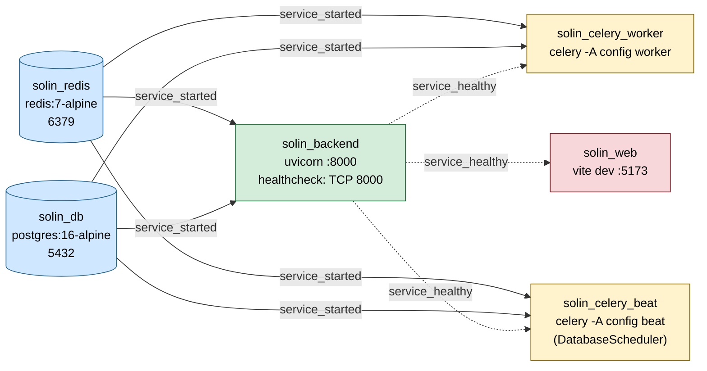
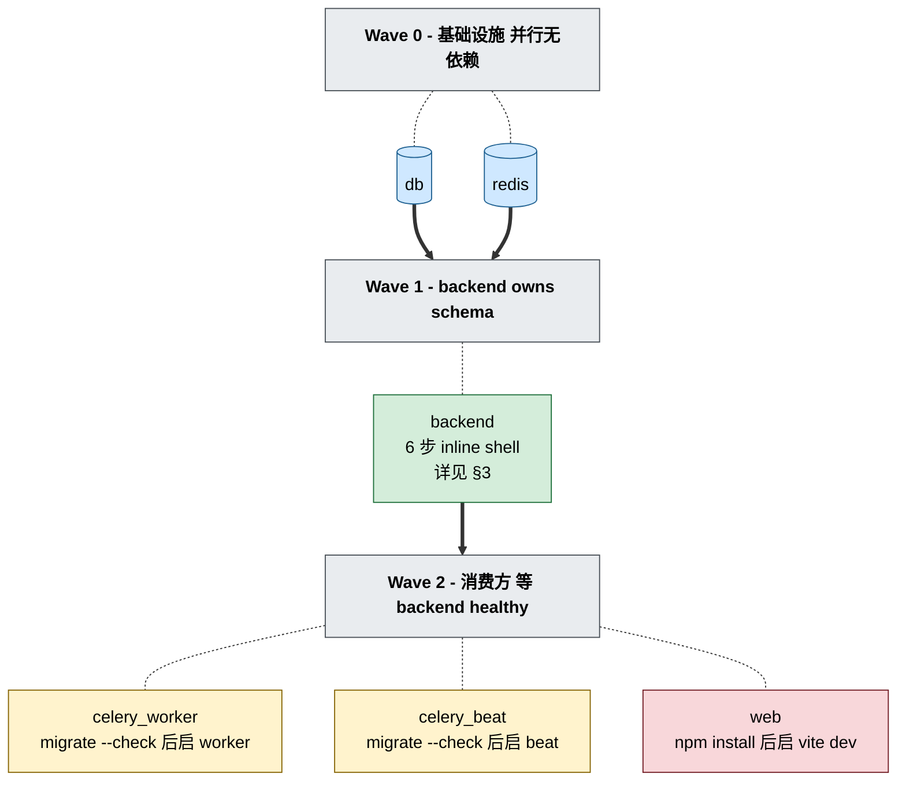
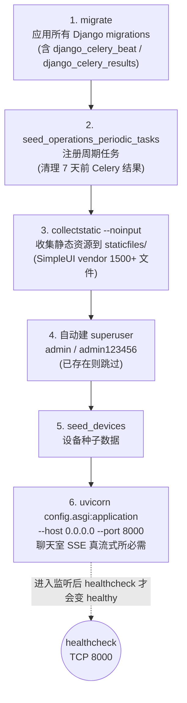
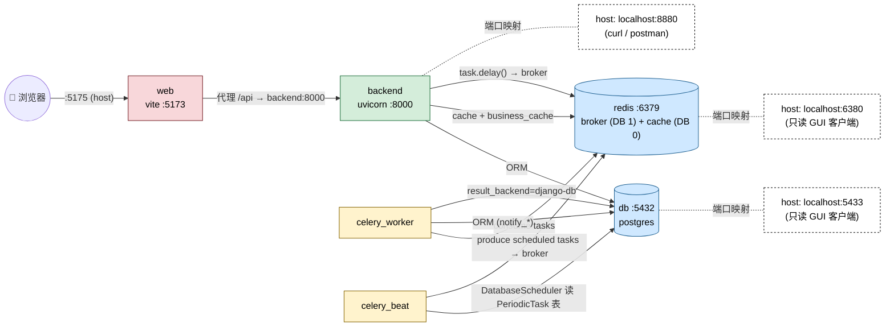
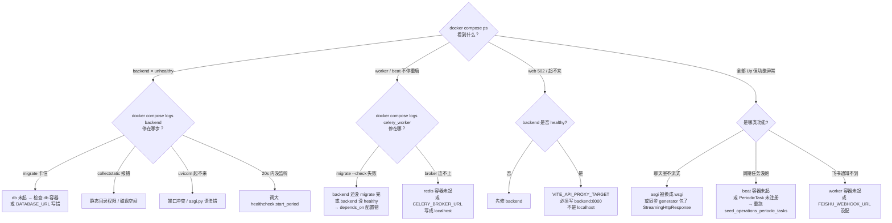

# Solin 容器依赖与启动流程

> 来源：[`docker-compose.yaml`](../docker-compose.yaml)
> 基线：6 个服务 — `db` / `redis` / `backend` / `celery_worker` / `celery_beat` / `web`
> 全部 `restart: always`；backend 三件套（backend / celery_worker / celery_beat）共用 `x-backend-build` 锚点

---

## 1. 依赖图（depends_on + condition）



**约定**：
- 实线 `service_started` = 容器启动即放行（不等 healthcheck）
- 虚线 `service_healthy` = 必须 backend healthcheck 通过才放行
- worker / beat 同时挂 backend healthy + db/redis started，是双保险

---

## 2. 启动波次（按时间轴）



**关键约束**：
| 节点 | 等什么 | 为什么 |
|---|---|---|
| backend | db + redis `started` | 网络可达即可，不需要等 db ready |
| celery_worker / celery_beat | backend `healthy`（+ migrate --check 双保险） | 必须 schema 已迁移，否则 migrate 检查失败 → 容器重启循环 |
| web | backend `healthy` | Vite 启动后立刻代理 API，没起来会 502 |

**healthcheck 窗口**：TCP 8000 探测，`start_period=20s` + `interval=5s` × `retries=30` ≈ **170s 上限**。首次启动迁移多时可能超窗，需要调大。

---

## 3. backend 容器 inline shell 启动序列（Wave 1 内部）

> 来源：[`docker-compose.yaml`](../docker-compose.yaml#L45) `backend.command:`
> **6 步串行**，任何一步失败整个容器重启



**坑点**：
- **不要**把 `uvicorn config.asgi` 换成 `wsgi`：聊天室 SSE 流式会立即退化成阻塞返回（详 [`backend/CLAUDE.md`](../backend/CLAUDE.md)）
- **不要**丢任何 seed 步骤：缺 `seed_devices` 设备列表空、缺 `seed_operations_periodic_tasks` 周期任务空、缺 superuser inline shell 卡 `/admin/` 入口
- 6 步固化在 compose `command:` 里，新增初始化插这条链路里、**不要**另开 entrypoint 脚本

---

## 4. 运行时数据流



**容器内主机名**（**不**用 localhost）：
- backend / worker / beat → `db:5432` 连数据库
- backend / worker / beat → `redis:6379` 连缓存与 broker
- web → `backend:8000` 代理 API

**Redis 多用途**：
- DB 0：Django cache backend（`django.core.cache.backends.redis.RedisCache`）
- DB 1（默认）：Celery broker（`CELERY_BROKER_URL=redis://...:6379/1`）
- `business_cache.py` 走 cache backend，结果带 `business-cache:<namespace>:` 前缀做命名空间隔离

**Celery 任务谱**（实际 5 个 `@shared_task`）：
- `notify_account_application` — 账号申请飞书通知
- `notify_command_event_task` — 控制指令操作飞书通知
- `notify_command_change_task` — 控制指令名称变更飞书卡片
- `cleanup_old_celery_results` — 周期任务，每天 03:00 清 7 天前结果（已通过 `seed_operations_periodic_tasks` 注册）
- `config.celery.debug_task` — scaffolding 遗留，未使用

---

## 5. 操作命令速查

```bash
# 一次起全部（按依赖图自动按 3 波次起）
docker compose up -d

# 看实时状态（重点关注 backend 列的 healthy / starting / unhealthy）
docker compose ps

# 重建 backend 镜像后，三个共用镜像的容器一起拉起来对齐
docker compose build backend
docker compose up -d backend celery_worker celery_beat

# 看 backend 启动序列日志（排查 6 步哪步卡了）
docker compose logs -f backend

# 看 worker/beat 任务消费日志
docker compose logs -f celery_worker celery_beat

# 进容器跑 manage.py（docker-only 强约束，宿主禁止）
docker compose exec backend python manage.py shell
docker compose exec backend python manage.py test apps.resources.tests
```

---

## 6. 故障定位决策树



---

## 关联文档

- [根 AGENTS.md](../AGENTS.md) — monorepo 编排约定 + ENVIRONMENT MANDATE
- [backend/AGENTS.md](../backend/AGENTS.md) — Django 模块约定
- [backend/config/AGENTS.md](../backend/config/AGENTS.md) — settings / urls / business_cache 细节
- [docker-compose.yaml](../docker-compose.yaml) — 真相源
